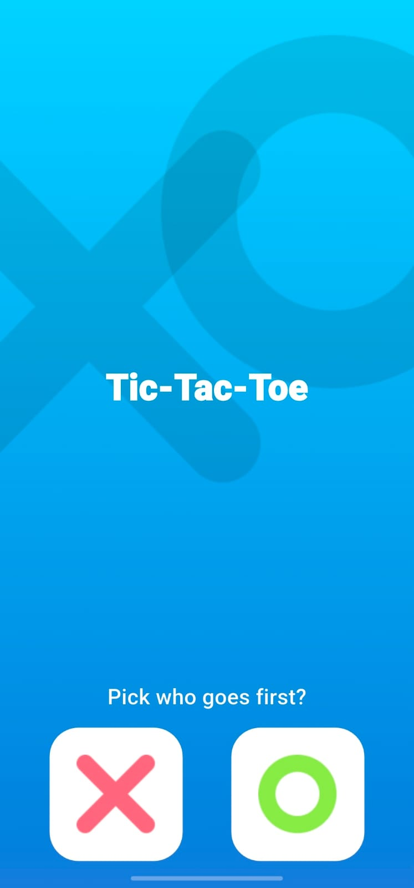
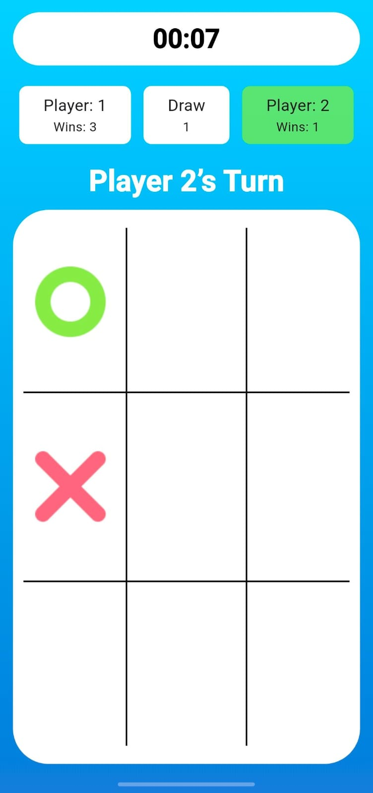
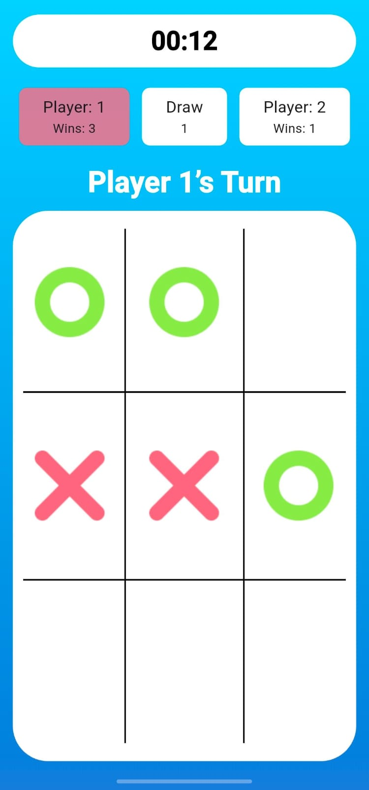
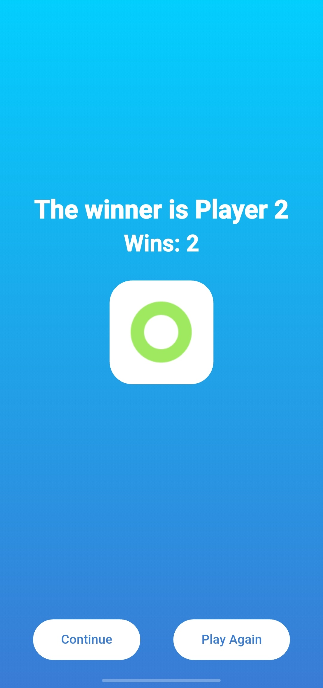

# XO Game

A polished Tic-Tac-Toe game built with Flutter.

## Overview

`xo_game` is a two-player Tic-Tac-Toe app with a clean gradient UI, turn selection, a live timer, score tracking, and a winner screen.

## Features

- Select which symbol goes first: X or O
- Two-player local gameplay on a 3x3 grid
- Turn-based UI with player status highlighting
- Real-time match timer
- Win detection and score tracking
- Draw count tracking
- Continue playing or restart from the winner screen

## Screens

1. **Welcome Screen**
    - Choose the first player symbol (X or O)
2. **Game Screen**
    - Play the Tic-Tac-Toe game
    - View the current player’s turn and scores
    - Track elapsed time for the match
3. **Win Screen**
    - Displays the winner and win count
    - Continue the game or return to start a new match

## Screenshots

## Project Structure

- `lib/main.dart` — App entry point and route setup
- `lib/ui/screens/` — UI screens for welcome, game, and win states
- `lib/ui/widgets/` — Reusable UI components
- `lib/models/player_dm.dart` — Player model, symbol and score management
- `lib/utils/` — App styles, colors, and asset constants
- `assets/images/` — Game assets for X, O, and background images
